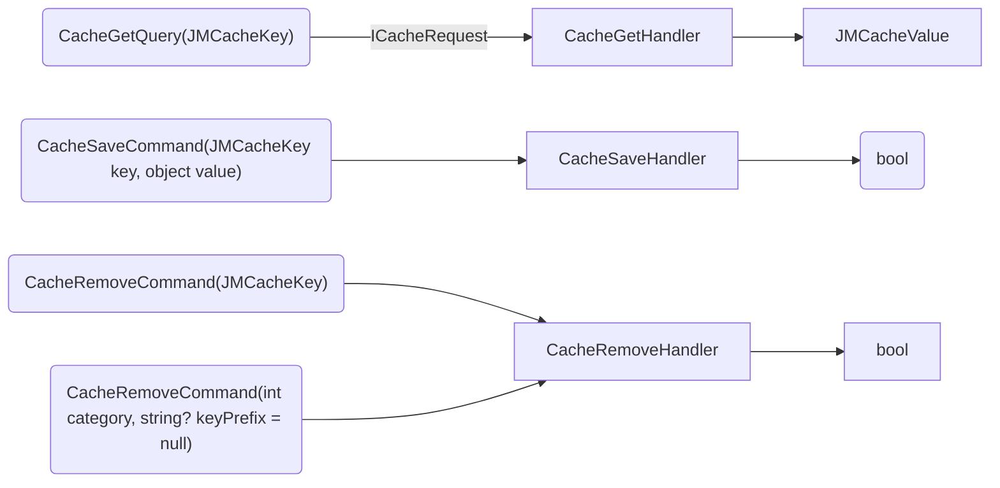
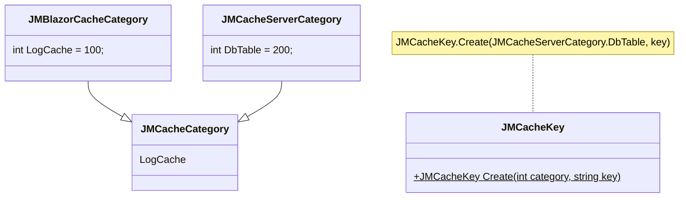
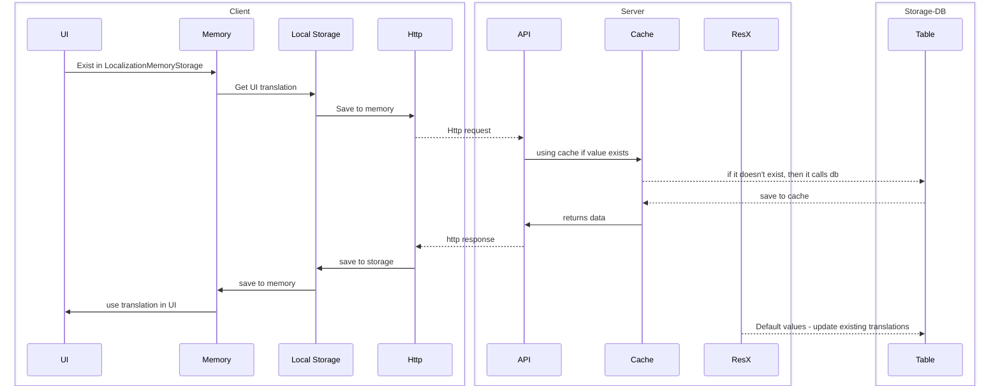

# About solutions
POC for .NET 8 and Blazor and not ready for production !!! This is a "private" project and some parts/ideas of the code may be ported to productions in other projects. 


## Technologies
### Backend
- .NET 8
- MSSQL
- Blazor WASM
- EF
  - Linq
  - Audit
- OAuth2
- MediatR
  - IPipelineBehavior
- Logging - Serilog
- Localizations

### Frontend
- fully responsive
- SCSS
- Telerik
- Localization
- Logging
  - via MediatR - in memory
  - TODO - send log information to Server
- Autofac
  - mainly for registration open generic type for MediatR -> IRequest,
```
containerBuilder.RegisterGeneric(typeof(HttpAuthorizedHandler<>)).AsImplementedInterfaces();
containerBuilder.RegisterGeneric(typeof(HttpNonAuthorizedHandler<>)).AsImplementedInterfaces();
```

### Testing
- xUnit
- Moq
- BUnit
- Selenium for E2E testing

### TODO to be production ready:
- Better code comments
- Better documentation
- UML diagrams
- tests, only JMCode has a code coverage of xUnit of around 70%.
- Stress tests

## Solutions:
General
- **JMCore** - general library for server and client development. It contains a common code base library for different .NET project type, like Blazor, MVC, MAUI etc.
- **JMCore.Client** - general library for client development
- **JMCore.Server** - general library for server development
- **JMCore.Tests** - xUnit tests for JMCore, JMCore.Client, JMCore.Server
- **JMCore.TestsIntegrations** - integration tests for JMCore.Server - MSSQL database
  

Blazor
- **JMCore.Blazor** - contains a basic Blazor layouts and components using Telerik components.
  It is built on JMCore and it can be used for WASM and server.
- **JMCore.Blazor.BUnit** - BUnit tests for Blazor components

Implementation
- **JMCoreTest.Blazor.Server** - Server path for web page, includes API
- **JMCoreTest.Blazor.Client** - Client WASM for web page implements JMCore.Blazor
- **JMCoreTest.Blazor.Shared** - Communications models between Server and Client
- **JMCoreTest.Blazor.EE** - End to end tests base on Selenium
--------

## Global features
### Cache
Cache uses Category, Key and Value to working with cache.

Cache is managed by MediatR request with using CacheBehavior for logging information.

**MediatR**


**UML Class**


TODO
- By using autofac open generic registration, use categories as strong type, not as int.
- The MediatR handler can separate different requests by category into different repositories such as memory, Redis, etc.
- Implement Prometheus/Grafana to get info, how the cache is used.

### Localizations
Implements IStringLocalizer and all translations are retrieved from IStringLocalizationStorage.
Translations can be loaded e.g. from database, browser local storage etc.

TODO 
- For larger applications, all the translation text is stored in memory and this is a bad solution. The application should only load the translations it needs.
- improve the implementation of IStringLocalizerFactory

Proposal for a solution


### EF with auditing
The entities to be audited can be set using the AuditAttribute attribute or can be set in AuditDbConfiguration.

```
[Auditable]
[Table("TestAttributeAudit")]
public class TestAttributeAuditEntity
{
    [Key] 
    public int Id { get; set; }
    
    public string Name { get; set; } = null!;

    [NotAuditable] 
    public string NotAuditableColumn { get; set; } = null!;
    
    public DateTime Created { get; set; }
}
```
or
```C#
 var auditConfiguration = new AuditDbConfiguration
 {
    AuditEntities = new List<string> { nameof(TestManualAuditEntity) },
    NotAuditProperty = new Dictionary<string, IEnumerable<string>>
    {
       { nameof(TestManualAuditEntity), new List<string>() { nameof(TestManualAuditEntity.NotAuditableColumn) } }  
    }
 };
```

DB structure


### DB
Currently only MSSQL is supported, but the solution is ready for other databases as well. The solution uses Entity Framework as the main ORM.


